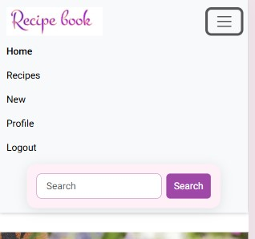
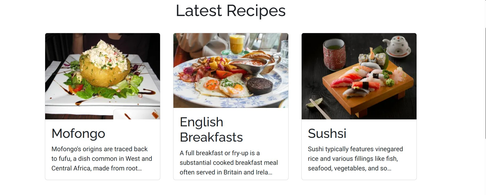
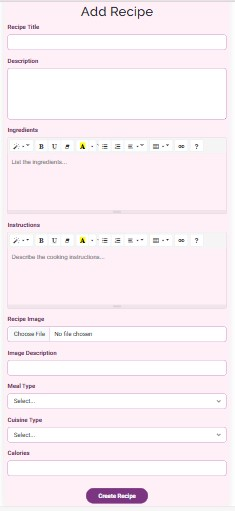
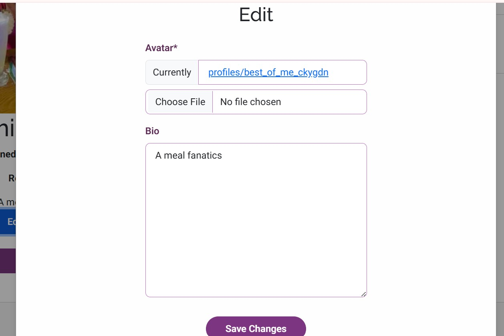
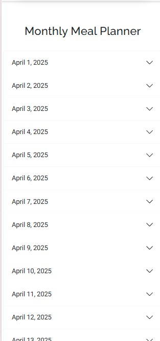

# Recipe Book

Recipe Book is a simple and welcoming web app where people from all cultures can share their favorite recipes, explore dishes from around the world, and even plan their meals for the month. Users can sign up, create a profile, upload photos, and add step-by-step instructions for their recipes. It’s all about celebrating food, culture, and making meal planning a little easier — one recipe at a time.   
Live link: https://recipe-book-app-345a4345dace.herokuapp.com/

## Overview
What makes The Recipe Book special is its focus on people. Anyone can sign up, create a profile, and start contributing their favorite recipes — complete with photos, cooking steps, and even monthly meal planning. It’s a beautifully responsive site that works on any screen, making it easy to browse on the go or in the kitchen. Built with Bootstrap 5, it offers a clean, modern look while staying flexible and intuitive. It’s not just about food — it’s about connection, community, and keeping culinary traditions alive.

## Features

__Existing features:__

- **Home page**
  
  - **Hero Section:** The hero section features a warm and inviting image of a beautifully decorated cupcake, an open recipe book, and a spoon — symbolizing creativity, tradition, and the joy of homemade meals. This visually striking banner sets the tone for the site, welcoming users into a space where recipes from diverse cultures are celebrated and shared.                                                                          
  
  - **Introductory Text:**   Sets the tone with a heartfelt message about the importance of food, community, and diversity, encouraging users to contribute and connect.                                                                        
  -  **Mobile-Responsive layout:**  Built with Bootstrap 5 to ensure a clean, functional design on all devices.

- **Recipe Search**
   - **Search Bar:** Users can search for recipes using keywords, making it easier to find specific dishes on the website.                                                                         
    
- **Navigation Menu:** Quick access to all major sections:
   - **Home:** Return to the landing page
   - **Recipes:** Browse all available recipes
   - **New:**  Add a new recipe to the collection.
   - **Profile:** View and manage user profile.
   - **Logout:**  Securely end user sessions.                                                                       
  
- **Recipes Pages:**
   - **View recipes:** Displays a list of all contributed recipes from various users.
   - **Responsive layout:** Recipes are shown in an organized grid or card format.
   - **Search filter support:** Works with the search bar for real-time recipe filtering.
  
  
  

- **Add Recipes Page:**
   - **User Submission Form:**  Allows registered users to submit a new recipe, including title, description, ingredients, steps, and an image.
   - **Rich Text Support:** With the use of Summernote, users can format recipe instructions (e.g., bold text, bullet points).
   - **Image Upload:** Uploads recipe photos via multipart/form-data.                                                                     

- **User Profile Page:**
  - **View Personal Info:** Displays the user's profile information;name, date joined and recipes added.                                                                         
   - **Edit Profile:** Users can update their profile details, image.
  
   - **Meal Planner Feature:** Users can plan meals across a month.                                                                             

- **Meal Planner:**
   - **Plan Monthly Meals:** Helps users organize their recipes; breakfast,lunch or dinner — perfect for family or personal meal scheduling.
   - **Custom Recipes:** Users can add their own recipes and assign them to specific days.                                                                           

- **Authentication:**
   - **Logout:** Ends a user session securely.
  
   - **Registration/Login:**  Users can create an account or log in to access features like profile management and recipe posting.
  
                                                                                 
- **CRUD Functionality:** 
   - **Create::** Logged-in users can add new recipes through a submission form. After adding a recipe, a pop-up success message (toast notification) confirms that the recipe was successfully created.
   - **Read:** All users (logged in or not) can browse and search the available recipes. Each recipe can be viewed on a dedicated detail page that shows full ingredients and instructions.
   - **Update:** Logged-in users can edit their own recipes directly from the recipe detail page. After making edits, a success toast notification appears to confirm that the recipe has been updated.
   - **Delete:** Users can delete their own recipes securely. After deletion, a toast notification pops up confirming that the recipe was removed successfully.

                                                                               
- **Responsive Design:**
  - Built using Bootstrap 5: 
    - Ensures consistent layout across mobile, tablet, and desktop:
    - Easy-to-use navbar and components for better UX.

- **Social Media Footer:**
   - **Social Links:**  Icons linking to Facebook, Instagram, X (Twitter), and YouTube.
   - **Accessible:**   All links include aria-labels and rel="noopener" for safe external navigation.

- **Toast Notifications (Placeholder):**
   -  A position-fixed toast container is included, suggesting support for alert messages like form success, recipe submission confirmation, or profile updates.  
   
   
## Bug Documentation

| Bug Description | Error Message/Behavior | Solution | Root Cause | Prevention Tips |
|----------------|----------------------|----------|------------|----------------|
| Form Validation Issues | Missing required fields not caught | Added comprehensive form validation in RecipeForm | Missing client-side validation | Implement both client and server-side validation |
| Image Upload Issues | "Invalid image format" error | Implemented ResizedImageField with WEBP format | Unsupported image formats | Use proper image field with format validation |
| Search Functionality | Incomplete search results | Fixed Q object queries in Recipes view | Incorrect query conditions | Test search functionality with various inputs |
| Meal Planner Logic | Null calories handling | Added default calories value (9999) | Null value conversion error | Add proper null checks and defaults |
| User Authentication | Unauthorized recipe edits | Added UserPassesTestMixin | Missing permission checks | Implement proper authentication checks |
| Rich Text Editor | Summernote initialization errors | Added proper initialization in profile.js | Missing editor initialization | Ensure proper script loading order |
| Database Queries | Slow recipe loading | Added proper indexing and ordering | Missing database optimization | Use proper database indexing |
| Form Error Display | Error messages not showing | Added error message display in templates | Missing error template handling | Implement proper error message display |
| Image Alt Text | Missing alt text validation | Added required alt text field | Missing accessibility features | Always require alt text for images |
| Recipe Deletion | Cascade delete issues | Fixed foreign key relationships | Improper model relationships | Use proper cascade delete settings |

## Best Practices for Bug Prevention
1. Implement comprehensive error logging
2. Use automated testing (unit tests, integration tests)
3. Regular code reviews
4. Monitor application performance
5. Keep dependencies updated
6. Follow security best practices
7. Document all changes and updates
8. Use version control effectively
9. Implement proper error handling
10. Regular security audits

## Contributing
If you encounter any new bugs, please:
1. Document the issue clearly
2. Provide steps to reproduce
3. Include error messages
4. Suggest possible solutions
5. Create a pull request with the fix
