# Recipe Book

Recipe Book is a simple and welcoming web app where people from all cultures can share their favorite recipes, explore dishes from around the world, and even plan their meals for the month. Users can sign up, create a profile, upload photos, and add step-by-step instructions for their recipes. It’s all about celebrating food, culture, and making meal planning a little easier — one recipe at a time.   
Live link: https://recipe-book-app-345a4345dace.herokuapp.com/


## Overview
What makes The Recipe Book special is its focus on people. Anyone can sign up, create a profile, and start contributing their favorite recipes — complete with photos, cooking steps, and even monthly meal planning. It’s a beautifully responsive site that works on any screen, making it easy to browse on the go or in the kitchen. Built with Bootstrap 5, it offers a clean, modern look while staying flexible and intuitive. It’s not just about food — it’s about connection, community, and keeping culinary traditions alive.

## Features

__Existing features:__

- **Home page**
  
  - **Hero Section:** The hero section features a warm and inviting image of a beautifully decorated cupcake, an open recipe book, and a spoon — symbolizing creativity, tradition, and the joy of homemade meals. This visually striking banner sets the tone for the site, welcoming users into a space where recipes from diverse cultures are celebrated and shared.                                                                          
  
  - **Introductory Text:**   Sets the tone with a heartfelt message about the importance of food, community, and diversity, encouraging users to contribute and connect.                                                                       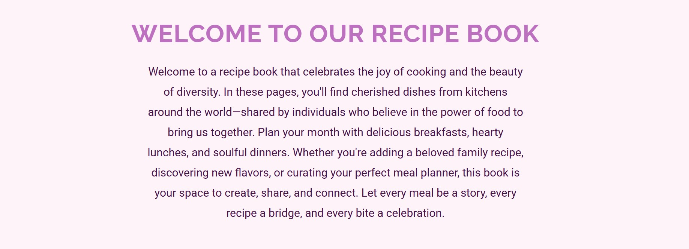 
  -  **Mobile-Responsive layout:**  Built with Bootstrap 5 to ensure a clean, functional design on all devices.

- **Recipe Search**
   - **Search Bar:** Users can search for recipes using keywords, making it easier to find specific dishes on the website.                                                                         
    
- **Navigation Menu:** Quick access to all major sections:
   - **Home:** Return to the landing page
   - **Recipes:** Browse all available recipes
   - **New:**  Add a new recipe to the collection.
   - **Profile:** View and manage user profile.
   - **Logout:**  Securely end user sessions.                                                                                                                        
  
- **Recipes Pages:**
   - **View recipes:** Displays a list of all contributed recipes from various users.
   - **Responsive layout:** Recipes are shown in an organized grid or card format.
   - **Search filter support:** Works with the search bar for real-time recipe filtering.
  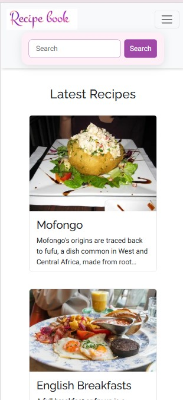
  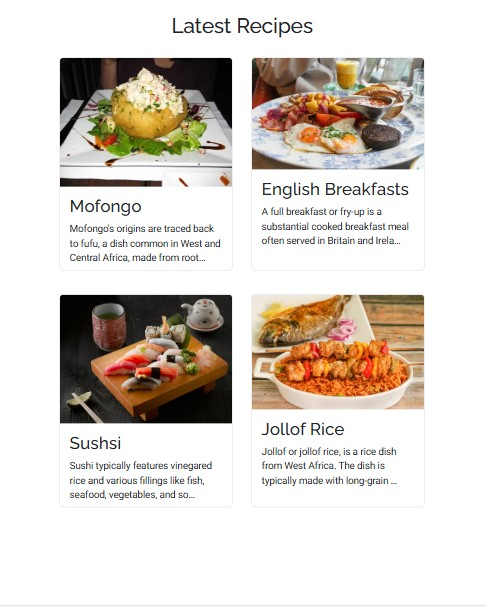
  

- **Add Recipes Page:**
   - **User Submission Form:**  Allows registered users to submit a new recipe, including title, description, ingredients, steps, and an image.
   - **Rich Text Support:** With the use of Summernote, users can format recipe instructions (e.g., bold text, bullet points).
   - **Image Upload:** Uploads recipe photos via multipart/form-data.                                                                     

- **User Profile Page:**
  - **View Personal Info:** Displays the user's profile information;name, date joined and recipes added.                                                                  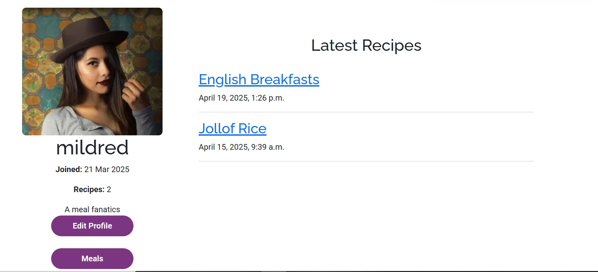
   - **Edit Profile:** Users can update their profile details, image.
  
   - **Meal Planner Feature:** Users can plan meals across a month.                                                                    

- **Meal Planner:**
   - **Plan Monthly Meals:** Helps users organize their recipes; breakfast,lunch or dinner — perfect for family or personal meal scheduling.
   - **Custom Recipes:** Users can add their own recipes and assign them to specific days.                                                                 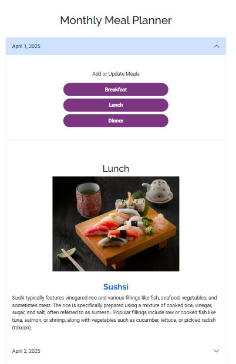

- **Authentication:**
   - **Logout:** Ends a user session securely.
  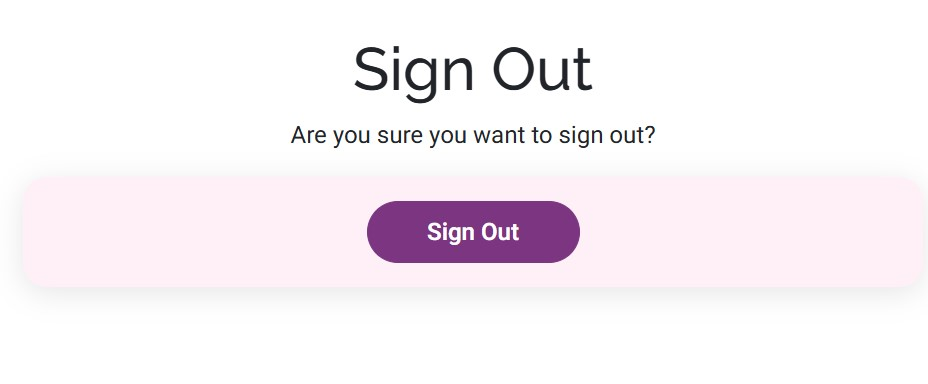
   - **Registration/Login:**  Users can create an account or log in to access features like profile management and recipe posting.


  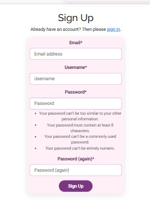
  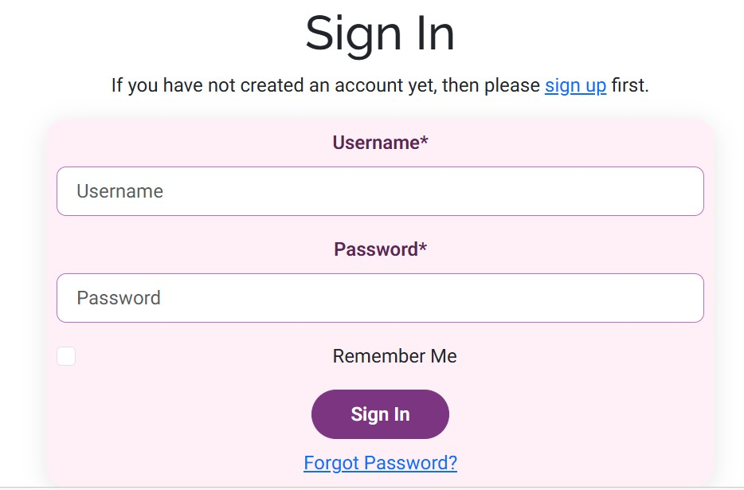                                                                               
- **CRUD Functionality:** 
   - **Create::** Logged-in users can add new recipes through a submission form. After adding a recipe, a pop-up success message (toast notification) confirms that the recipe was successfully created.
   - **Read:** All users (logged in or not) can browse and search the available recipes. Each recipe can be viewed on a dedicated detail page that shows full ingredients and instructions.
   - **Update:** Logged-in users can edit their own recipes directly from the recipe detail page. After making edits, a success toast notification appears to confirm that the recipe has been updated.
   - **Delete:** Users can delete their own recipes securely. After deletion, a toast notification pops up confirming that the recipe was removed successfully.
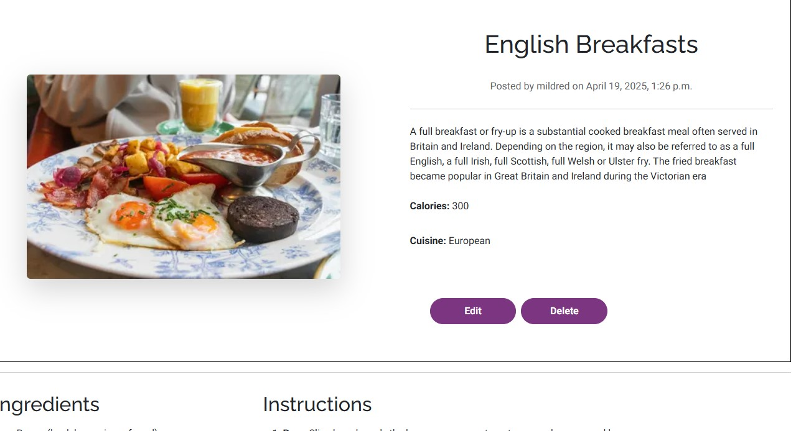
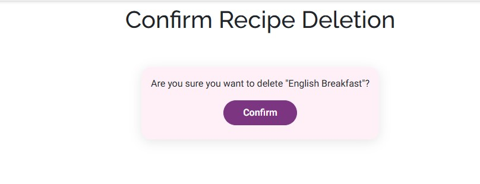
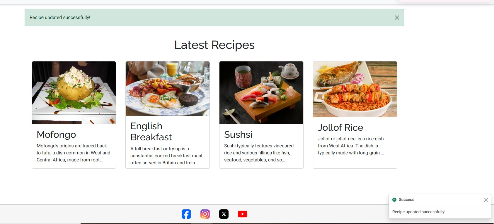                                                                               
- **Responsive Design:**
  - Built using Bootstrap 5: 
    - Ensures consistent layout across mobile, tablet, and desktop:
    - Easy-to-use navbar and components for better UX.

- **Social Media Footer:**
   - **Social Links:**  Icons linking to Facebook, Instagram, X (Twitter), and YouTube.
   - **Accessible:**   All links include aria-labels and rel="noopener" for safe external navigation.

- **Toast Notifications (Placeholder):**
   -  A position-fixed toast container is included, suggesting support for alert messages like form success, recipe submission confirmation, or profile updates.  
   

- **Admin Panel:**

  - As a developer, you'll be able to leverage Django’s built-in Admin Interface to easily manage content such as ice cream reviews, user comments, and form submissions.
  - Admin users can view, approve, or delete as needed to maintain site integrity.

  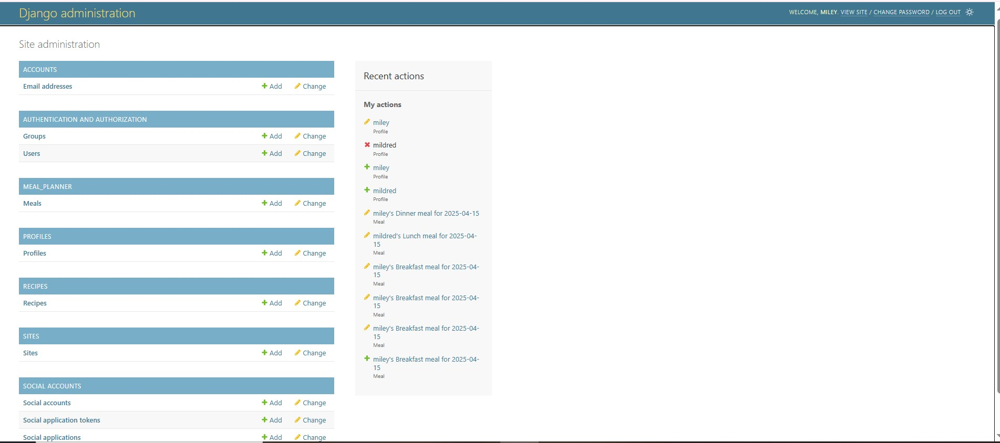 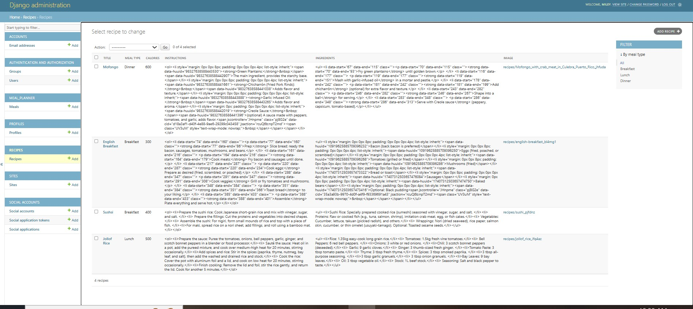

## Agile

For the Agile process utilized within Github project board and user stories. Detailing the production process and highlighting issues when they arose. 

### Project Issues

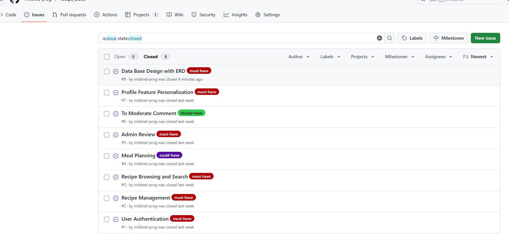
 

A MOSCOW framework has been utilized. 

**Mo:** Core functionalities like User Authentication, Recipe Management (CRUD), and Recipe Browsing/Search were essential for the app to function. \
**S:** Profile Feature Personalization and Admin Review were implemented to enhance user experience and maintain quality control. \
**Co:** Meal Planning was added as extra features to enrich the platform but were not critical at launch. \
**W:** Advanced features like AI-based recipe recommendations or real-time chat support were considered but intentionally left out for future   versions.                                           


## User Stories

User stories were used to keep track of the MOSCOW framework and project MVP as working through the project. 

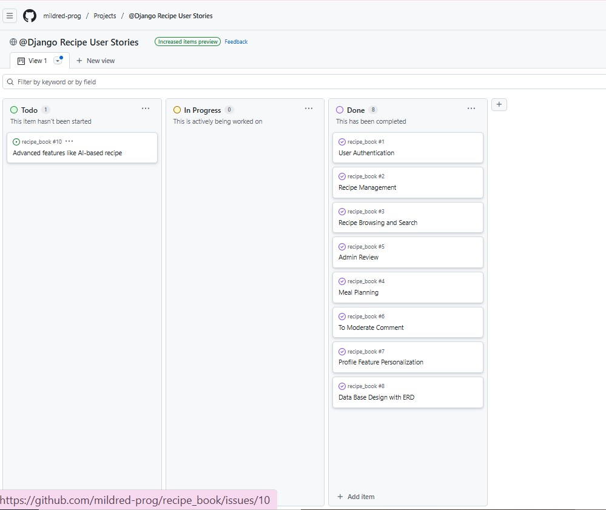


| **User Story** | **Details** | **Acceptance Criteria** |
|:--------------|:------------|:-------------------------|
| **User Authentication** | Users want to sign up, log in, and update their profile. | 1. Register with email/password<br>2. Redirect on login<br>3. Login with credentials<br>4.Update name and bio |
| **Recipe Management (CRUD)** | Users want to add, edit, delete, and view recipes with title, ingredients, instructions, and image. | 1. Create, edit, delete recipes<br>2.Recipes have title, ingredients, instructions, image<br>3. Users modify only their own recipes |
| **Recipe Search** | Users want to search for recipes by name or ingredients. | 1. Search by keywords<br>2. Display relevant results |
| **Meal Planning** | Users want to plan meals by adding recipes to a monthly planner either for breakfast, lunch or dinner | 1. Add recipes to monthly planner<br>2. Edit/remove meals from planner |
| **Admin Recipe Review** | Admins want to manage users and approve or remove recipes. | 1. Review new recipes<br>2.Remove inappropriate recipes |
| **Comment Moderation** | Admins want to moderate and delete inappropriate comments. | 1. View all comments<br>2.Delete violating comments<br>3. Deleted comments disappear from recipes |
| **Profile Personalization** | Users want to manage profiles. | 1.Create/view/update profile<br>2.Delete profile if desired |
| **AI-Based Recommendations (Future Feature)** | Users want personalized recipe suggestions based on their activity. | 1.Suggest recipes based on user actions<br>2.Update recommendations dynamically<br>3. Add "Recommended for You" section<br>4. Allow opt-in/opt-out |


## Site Testing 

Please see [TESTING.md](TESTING.md) document.

## UX/UI Wireframing

- **Logo and Branding:**
  - The site features a custom-designed logo that combines a **cupcake, a spoon, and a book**, symbolizing the blend of food, creativity, and learning.
  - The text **"Recipe Book"** is stylishly integrated into the logo, custom styled in **purple** to create a warm, inviting, and creative feel.
  - The primary fonts used are **Raleway**, **Roboto**, and **sans-serif**, offering a clean, modern, and readable appearance that complements the casual yet polished theme.

- **Navigation:**
  - The navigation bar is clear and simple, ensuring users can easily move through the site.
  - It includes the following links:
    - **Home**: Takes users to the main landing page.
    - **Recipes**: Displays all available recipes.
    - **New**: Allows users to add a new recipe.
    - **Profile**: Manage dietary preferences, profile details, and view personalized recommendations.
    - **Logo**: Placed prominently and clickable, redirecting users to the homepage.
  - The navbar is fully **responsive**, collapsing neatly into a hamburger menu on mobile devices.

- **Hero Section and Welcome Message:**
  - Positioned directly under the navbar is a **hero banner** featuring a welcoming **paragraph**:
    - **"Welcome to Our Recipe Book"**
  - Below the heading is a **short welcoming text** introducing the platform, inviting users to discover, create, and share recipes that align with their lifestyle, tastes, and goals.

- **User Interaction and Feedback:**
  - Users can **register**, **log in**, and **personalize** their profiles.
  - **Toast-style pop-up notifications** appear to confirm successful actions like adding, editing, or deleting a recipe, enhancing user feedback.
  - Only authenticated users can modify their own recipes, ensuring privacy and control.

- **Design and Visual Style:**
  - The color palette centers around **shades of purple** with clean, light backgrounds to maintain an inviting and appetizing atmosphere.
  - **Custom CSS** works alongside **Bootstrap 5** to ensure responsiveness and beautiful, consistent styling across all devices.
  - Design elements include rounded buttons, soft shadows, and spacious forms for improved usability.

- **Search and Recipe Management:**
  - A **search bar** allows users to find recipes by keywords such as title or ingredient.
  - Recipes are presented with featured images, ingredients, and clear cooking instructions to enhance readability.

- **Community and Future Engagement:**
  - Users can **comment** on recipes, sharing tips or feedback, with moderation tools in place for quality control.
  - Future upgrades include **AI-powered personalized recipe suggestions**, offering smarter recommendations based on user activity.
  - **Social media icons** (Instagram, Twitter) are featured in the footer, encouraging users to stay connected with the Recipe Book community.

### Wireframe


### UI Color Palette


---

### ERD Design


### Database Model

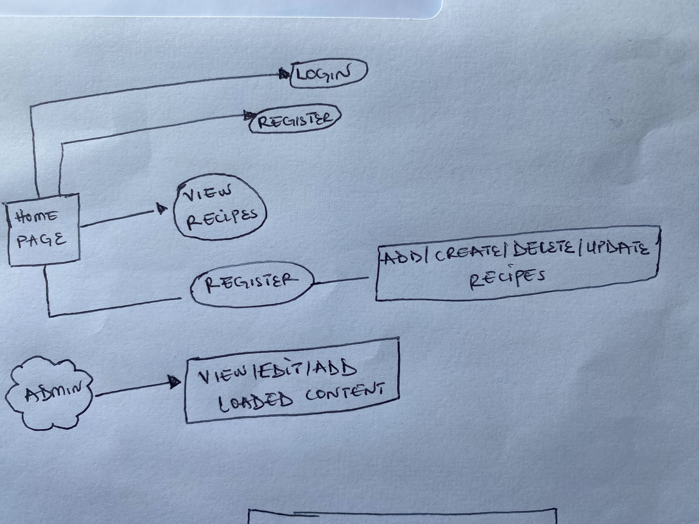

## Technologies Used

### Languages

__Application Structure__

- **Frontend:**
  - HTML5/CSS3: Provides structure and styling for reviews and user interactions.
  - Bootstrap: Responsive design for easy navigation on various screen sizes.
  - JavaScript: Enhances interactivity (dynamically toggling comments visibility).

- **Backend:**
  - Django Framework (Python): Handles routing, user authentication etc.

### Libraries & Frameworks

- Django v4.2.17
- Django AllAuth v0.57.2
- Django Crispy Forms v2.0
- Crispy Bootstrap5 v0.7
- Django Summernote v0.8.2
- Cloudinary v1.36.0
- Python v3.13.0

### Other Sites

- Testing & Validation
  - HTML: https://validator.w3.org/nu/
  - CSS: https://jigsaw.w3.org/css-validator/#validate_by_uri
  - JavaScript: https://jshint.com/
  - Python: https://pep8ci.herokuapp.com/
  - Accessibility: https://wave.webaim.org/

- Responsive Screen Preview
  -Am I responsive?: https://ui.dev/amiresponsive

- Images downloaded under licensed user
  - Adobe Stock: https://stock.adobe.com/

- Turning FontAwesome icon into sized favicons
  - Favicon: https://favicon.io/
    
- Image assets reduced with online platforms
  - TinyPNG: https://tinypng.com/
  - Bulk Sizing: https://imageresizer.com/bulk-resize/
  - Reduce Images: https://www.reduceimages.com/

- Assisted problem solving sites:
  - https://forums.knack.com/
  - https://docs.djangoproject.com/
  - https://developer.mozilla.org/
  - https://stackoverflow.com/
  - https://www.w3schools.com/
  - https://www.geeksforgeeks.org/


## Django Project Setup

1. Install Django and supporting libraries: 
   
- ```pip install 'django<4' gunicorn```
- ```pip install dj_database_url psycopg2```
- ```pip install django-cloudinary-storage```  
  
2. Once you have installed any relevant dependencies or libraries, such as the ones listed above, it is important to create a **requirements.txt** file and add all installed libraries to it with the ```pip freeze --local > requirements.txt``` command in the terminal.  
3. Create a new Django project in the terminal ```django-admin startproject main .```
4. Create a new app eg. ```python manage.py startapp profiles```
5. Add this to list of **INSTALLED_APPS** in **settings.py** - 'reviews',
6. Create a superuser for the project to allow Admin access and enter credentials: ```python manage.py createsuperuser```
7. Migrate the changes with commands: ```python manage.py migrate```
8. An **env.py** file must be created to store all protected data such as the **DATABASE_URL** and **SECRET_KEY**. These may be called upon in your project's **settings.py** file along with your Database configurations. The **env.py** file must be added to your **gitignore** file so that your important, protected information is not pushed to public viewing on GitHub. For adding to **env.py**:

- ```import os```
- ```os.environ["DATABASE_URL"]="<copiedURLfromPostgresSQL>"```
- ```os.environ["SECRET_KEY"]="my_super^secret@key"```
  
For adding to **settings.py**:

- ```import os```
- ```import dj_database_url```
- ```if os.path.exists("env.py"):```
- ```import env```
- ```SECRET_KEY = os.environ.get('SECRET_KEY')``` (actual key hidden within env.py)  

9. Replace **DATABASES** with:

```
DATABASES = {
    'default': dj_database_url.parse(os.environ.get("DATABASE_URL"))
  }
```

10. Set up the templates directory in **settings.py**:
- Under ``BASE_DIR`` enter ``TEMPLATES_DIR = os.path.join(BASE_DIR, ‘templates’)``
- Update ``TEMPLATES = 'DIRS': [TEMPLATES_DIR]`` with:

```
os.path.join(BASE_DIR, 'templates'),
os.path.join(BASE_DIR, 'templates', 'allauth')
```

- Create the media, static and templates directories in top level of project file in IDE workspace.

11. A **Procfile** must be created within the project repo for Heroku deployment with the following placed within it: ```web: gunicorn main.wsgi```
12. Make the necessary migrations again.

## Cloudinary API 

Cloudinary provides a cloud hosting solution for media storage. All users uploaded images in The Recipe_book project are hosted here.

Set up a new account at [Cloudinary](https://cloudinary.com/) and add your Cloudinary API environment variable to your **env.py** and Heroku Config Vars.
In your project workspace: 

- Add Cloudinary libraries to INSTALLED_APPS in settings.py 
- In the order: 
```
   'cloudinary_storage',  
   'django.contrib.staticfiles',  
   'cloudinary',
```
- Add to **env.py** and link up with **settings.py**: ```os.environ["CLOUDINARY_URL"]="cloudinary://...."``` 
- Set Cloudinary as storage for media and static files in settings.py:
- ```STATIC_URL = '/static/'```
```
  STATICFILES_STORAGE = 'cloudinary_storage.storage.StaticHashedCloudinaryStorage'  
  STATICFILES_DIRS = [os.path.join(BASE_DIR, 'static'), ]  
  STATIC_ROOT = os.path.join(BASE_DIR, 'staticfiles')‌  
  MEDIA_URL = '/media/'  
  DEFAULT_FILE_STORAGE = 'cloudinary_storage.storage.MediaCloudinaryStorage'
```

## Postgres SQL

A new database instance can be created on [Postgres SQL](https://www.postgresql.org/) for your project. 

- From your user dashboard, retrieve the important 'postgres://....' value. Place the value within your **DATABASE_URL**  in your **env.py** file and follow the below instructions to place it in your Heroku Config Vars.


## Deployment

### Cloning of the Repository Code locally
- The terminal function and template for the deployable application was provided by Code Institute
  - Go to the Github repository that you want to clone
  - Click on the Code button located above all the project files
  - Click on HTTPS and copy the repository link
  - Open the IDE of your choice and paste the copied git url into the IDE terminal
  - The project is now created as a local clone

| **STEPS** | **CODE** | 
| --------- | -------- |
| **In GitHub** |
| Create a new Github Repo | Github > new Repository |
| Open Repo | If your Github is utilising the plugin click 'Open' to launch your preferred IDE |
| **In IDE**|
| Install Django: | pip3 install Django~=4.2.1 |
| Create requirements file | pip3 freeze --local > requirements.txt |
| Create Project (scoop_project)| Django-admin startproject recipebook . |
| Run Server | python manage.py runserver |
| Add Servers to ALLOWED_HOSTS in settings.py | ALLOWED_HOSTS = ALLOWED_HOSTS = ['127.0.0.1', '.herokuapp.com'] |
| Create App (app_name) | python3 manage.py startapp app_name |
| Add to INSTALL_APPS in settings.py | INSTALLED_APPS = [… 'app_name',] |
| **Set Up Heroku** |
| Heroku Dashboard | https://www.heroku.com/ |
| Create new Heroku App | Choose unique name / select close region |
| Add Config Vars | Config Vars > Reveal Config Vars > Add New Key > DISABLE_COLLECTSTATIC value 1 |
| **In IDE** |
| Install web server Gunicorn and freeze | pip3 install gunicorn~=20.1 \ pip3 freeze --local>requirements.txt |
| Create Procfile | create Procfile in root directory |
| Declare Procfile | Add `web : gunicorn main.wsgi` in Procfile |
| **In Heroku** |
| Connect Repository | Navigate to Deploy tab > connect to Github Repo |
| Check Add ons & Dynos | Inside app resources make sure to use Eco Dynos. Delete PostGres DB Add-ons |
| **Database** |
| Create Postgres Database | CI Database Creator - https://dbs.ci-dbs.net/ |
| **In IDE** |
| Install Database Packages | pip3 install dj-database-url~=0.5 psycopg / then pip3 freeze --local > requirements.txt |
| Create env.py file | Root directory add env.py and add to .gitignore |
| **In env.py** |
| import OS | Top line 'import os' |
| set environment variables | os.environ["DATABASE_URL"] = "Paste in PostgreSQL database URL" |
| Secret Key | os.environ["SECRET_KEY"] = "Make up your own randomSecretKey" |
| **In Heroku** | 
| Add Secret Key to Config Vars |  SECRET_KEY, “randomSecretKey” |
| Add a Config Var called DATABASE_URL | DATABASE_URL, 'yourDBUrlGoesHere' |
| **In settings.py** |
| Link to env.py | from pathlib import Path, import os, import dj_database_url, if os.path.isfile("env.py"): import env |
| Remove secret key | SECRET_KEY = os.environ.get('SECRET_KEY') |
 | Comment out old Database section | # DATABASES = { } ( # on each line ) |
| Add new Databases section | DATABASES = {'default': dj_database_url.parse(os.environ.get("DATABASE_URL"))} |
| **Migrate Database** |
| Save all files and Migrate | python manage.py migrate |
| **Create Super User** |
| Create Super User | python manage.py createsuperuser |
| **In settings.py** |
| Set DEBUG to false | DEBUG = False |
|**Redeploy** |
| Push all Git changes and commits | Redeploy to Heroku |

### Version Control
- The Recipe_book was created using Visual studio code editor and pushed to Github to the remote repository 'recipe_book'
- Git commands were used throughout the development to push the code to the remote repository
- The following git commands were used:
  - git add .  to add the files to the staging area before being committed
  - git commit -m "commit message", to commit changes to the local repository queue that are ready for the final step
  - git push, to push all committed code to the remote repository on Github
  - pip3 install imports, for python library loads
  - add loaded packages to requirements.txt file for Heroku:
    - Run `pip freeze > requirements.txt` in the terminal

