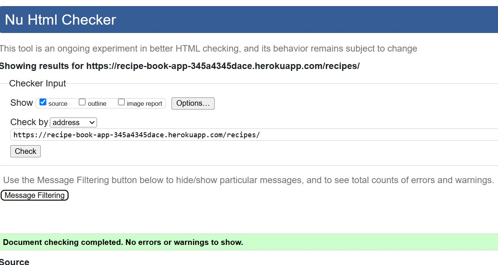
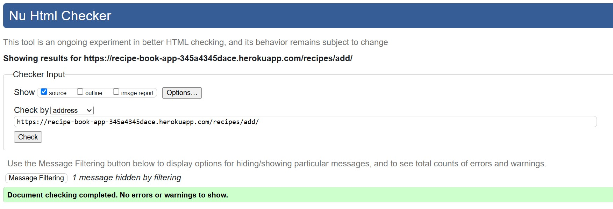
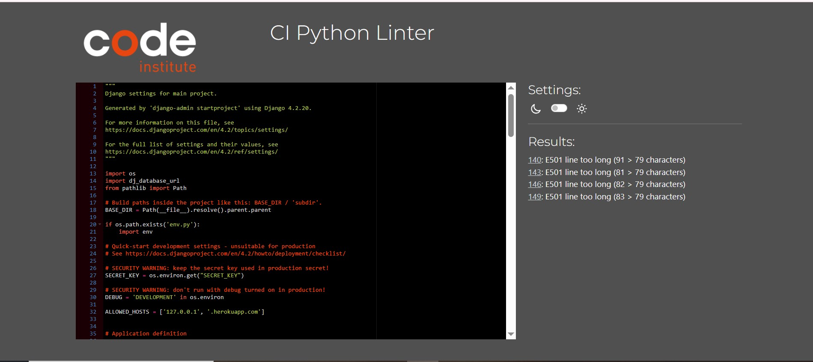

# Testing

Testing file for Recipe Book [README.md](README.md).

## Testing User Stories

### Developer Stories

- [x] Frontend and Backend of the project created.
- [x] Database is connected to the project.
- [x] App deployed on Heroku.

### User Stories

## Validation

### Validation Errors

### HTML Validation Corrected

- [x] HTML validation all passed:

**Home page**  

**Login Page**  

**Logout Page**  

**Recipes Page**  

**Recipes Add Page**  

### CSS Validation Corrected

### JSHint

- [x] JavaScript tests all passed.

### CI Python Linter

- [x] Python tests all passed.

## Lighthouse Test

- [x] Mobile view:

    **Home**  
    

    **Recipes Page**  
    
    
    **Add Recipes Page**  
    

    **Profile Page**  
    

    **Menu Planner Page**  
    

    **Log-in page**  
    

    **Logout Page**  
    

- [x] Desktop view:  
  
     **Home Page**  
    

    **Recipes Page**  
    
    
    **Add Recipes Page**  
    

    **Profile Page**  
    

    **Menu Planning Page**  
    

    **log-in page**  
    

    **Logout Page**  
    

    

    

## Bug Documentation

| Bug Description | Error Message/Behavior | Solution | Root Cause | Prevention Tips |
|----------------|----------------------|----------|------------|----------------|
| Form Validation Issues | Missing required fields not caught | Added comprehensive form validation in RecipeForm | Missing client-side validation | Implement both client and server-side validation |
| Image Upload Issues | "Invalid image format" error | Implemented ResizedImageField with WEBP format | Unsupported image formats | Use proper image field with format validation |
| Search Functionality | Incomplete search results | Fixed Q object queries in Recipes view | Incorrect query conditions | Test search functionality with various inputs |
| Meal Planner Logic | Null calories handling | Added default calories value (9999) | Null value conversion error | Add proper null checks and defaults |
| User Authentication | Unauthorized recipe edits | Added UserPassesTestMixin | Missing permission checks | Implement proper authentication checks |
| Rich Text Editor | Summernote initialization errors | Added proper initialization in profile.js | Missing editor initialization | Ensure proper script loading order |
| Database Queries | Slow recipe loading | Added proper indexing and ordering | Missing database optimization | Use proper database indexing |
| Form Error Display | Error messages not showing | Added error message display in templates | Missing error template handling | Implement proper error message display |
| Image Alt Text | Missing alt text validation | Added required alt text field | Missing accessibility features | Always require alt text for images |
| Recipe Deletion | Cascade delete issues | Fixed foreign key relationships | Improper model relationships | Use proper cascade delete settings |

## Best Practices for Bug Prevention
1. Implement comprehensive error logging
2. Use automated testing (unit tests, integration tests)
3. Regular code reviews
4. Monitor application performance
5. Keep dependencies updated
6. Follow security best practices
7. Document all changes and updates
8. Use version control effectively
9. Implement proper error handling
10. Regular security audits

## Contributing
If you encounter any new bugs, please:
1. Document the issue clearly
2. Provide steps to reproduce
3. Include error messages
4. Suggest possible solutions
5. Create a pull request with the fix
